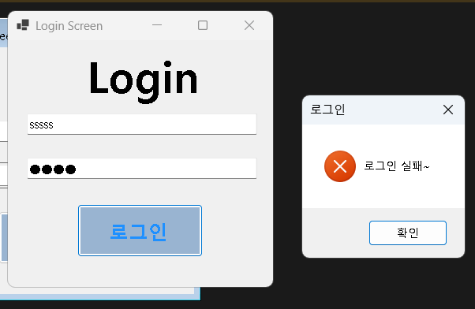
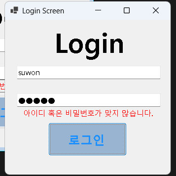
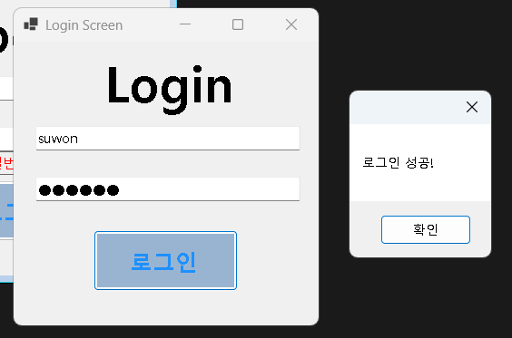
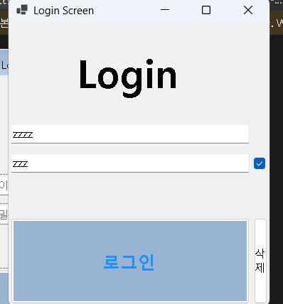
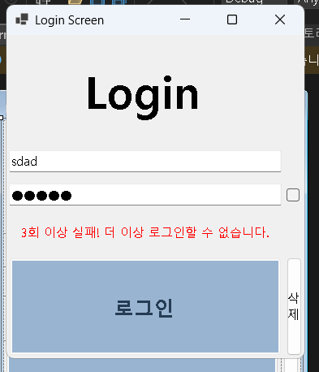

# (C# 코딩) 보안 로그인 시스템 LoginScreen
## 개요
- C# 프로그래밍 및 Windows Forms 기반 인증 시스템 UI/UX 학습
- 1줄 소개: 사용자의 아이디와 비밀번호를 검사하여 접근 허용/차단을 판단하고, 보안 기능을 수행하는 로그인 프로그램
- 사용한 플랫폼: 
	- C#, .NET Windows Forms, Visual Studio, GitHub
- 사용한 컨트롤: 
	- Label, TextBox, Button, CheckBox, Timer
- 핵심 기능:
	- 로그인 인증: 비교 연산자(==)와 논리 연산자(&&)를 활용해 아이디와 비밀번호를 동시 검증
	- 보안 시도 제한: 3회 로그인 실패 시 버튼을 비활성화하고 정해진 시간 동안 재시도를 차단
	- 입력 유효성 검사: 공백 체크 및 정규표현식을 이용한 비밀번호의 숫자/특수문자 포함 여부 확인
	- 사용자 편의(UX): Enter 키를 이용한 포커스 이동 및 자동 로그인 실행 기능
	- 입력 제어: 비밀번호 마스킹(UseSystemPasswordChar) 및 보기/가리기 토글 기능
- 화면 구성:
	- 입력 창 (중앙부): 아이디와 비밀번호를 입력받으며, Placeholder 기능을 통해 입력 안내 메시지 제공
	- 상태 안내 (하단부): 로그인 실패 시 에러 메시지를 빨간색 레이블로 출력하여 실시간 피드백 제공
	- 조작 패널: 로그인 버튼 외에 모든 입력값을 한 번에 지우는 '삭제(Clear)' 버튼 배치

- 사용한 기술과 구현한 기능:
	- 조건부 분기 처리: if~else 문을 활용하여 로그인 성공/실패 상황에 따른 개별 로직 수행
	- 이벤트 핸들러 최적화: KeyDown 이벤트를 통한 키보드 인터랙션 제어 및 Tick 이벤트를 통한 보안 잠금 시간 관리
	- 컨트롤 속성 동적 제어: Visible 속성으로 에러 메시지 노출을 관리하고 Enabled 속성으로 버튼 활성화 상태 제어
	- 문자열 및 형식 검증: string.IsNullOrWhiteSpace와 Regex를 활용한 데이터 무결성 검사

## 실행 화면 (과제1)
- 과제1 코드의 실행 스크린샷

![과제1 실행화면]
- 

- 과제 내용: 
	- 기본 UI 배치 및 기본적인 아이디/비밀번호 일치 확인 기능 구현
	- 로그인 성공 및 실패 시 각각 적절한 메시지 박스 출력

- 구현 내용과 기능 설명:
	- txtID와 txtPW에 입력된 텍스트를 가져와 설정된 정답 값과 비교하는 로직을 작성함.
	- 비밀번호 입력창의 UseSystemPasswordChar 속성을 설정하여 입력 내용이 외부로 노출되지 않도록 보안을 강화함.

## 실행 화면 (과제2)
- 과제2 코드의 실행 스크린샷

![과제2 실행화면]

- 과제 내용: 
	- 에러 메시지를 메시지 박스가 아닌 화면상의 레이블(lbl_Fail)로 표시
	- Visible 속성을 이용한 메시지 숨기기/보이기 기능 구현

- 구현 내용과 기능 설명:
	- 로그인 버튼 클릭 시 실패할 경우에만 lbl_Fail.Visible = true를 실행하여 경고 문구를 표시함
	- 성공 시에는 해당 레이블을 다시 숨겨 화면을 깔끔하게 유지하도록 처리함.

## 실행 화면 (과제3)
- 과제3 코드의 실행 스크린샷

![과제3 실행화면]

- 과제 내용:
	- Enter 키를 활용한 포커스 흐름 정리 및 전체 지우기/비번 보기 기능 추가

- 구현 내용과 기능 설명:
	- 아이디 칸에서 Enter 입력 시 txtPW.Focus()를 통해 패스워드 칸으로 자동 이동하게 함.
	- 패스워드 칸에서 Enter 입력 시 btnLogin.PerformClick()을 실행하여 즉시 로그인이 시도되도록 구현함.
	- '삭제' 버튼을 통해 입력값과 에러 메시지를 한 번에 초기화하는 기능을 추가함.

## 실행 화면 (과제4)
- 과제4 코드의 실행 스크린샷

![과제4 실행화면]

- 과제 내용: 
	- 아이디/비밀번호 입력 문자 제한 및 로그인 실패 횟수 제한 기능 구현
	- 잠금 시간 경과 후 재시도 가능 로직 추가

- 구현 내용과 기능 설명:
	- 비밀번호에 숫자와 특수문자가 포함되지 않으면 로그인이 진행되지 않도록 유효성 검사 로직을 강화함.
	- 3회 실패 시 버튼을 비활성화(Enabled = false)하고 Timer를 작동시켜 10초간 로그인을 차단함.
	- 타이머의 Tick 이벤트마다 남은 시간을 실시간으로 화면에 갱신하여 사용자에게 정보를 제공함
	
## 배운 내용
- UI 화면에 보이는 텍스트와 프로그램 내부에서 판단을 위해 사용하는 데이터의 상태를 분리하여 관리하는 법을 배웠습니다.
- 사용자의 잘못된 조작이나 반복적인 실패 상황을 기술적으로 방어하는 방어적 프로그래밍 기법을 익혔습니다
- Timer 컨트롤을 활용해 특정 시간 동안 프로그램의 상태를 유지하거나 해제하는 시간 기반 제어 로직을 실습했습니다.
- Substring, Remove, StartsWith 등의 문자열 처리 함수를 적극적으로 활용해 화면의 수식을 동적으로 수정하고, 음수에 괄호를 씌웠다 벗기는 등 디테일한 UX를 제어하는 과정에서 C#의 내장 함수 활용 능력이 크게 향상되었습니다.포커스 이동, 자동 클릭, 비밀번호 토글 등 작은 기능들이 사용자의 편의성에 얼마나 큰 영향을 주는지 경험했습니다.